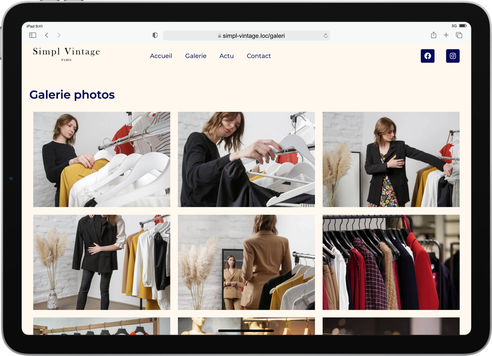

# Simpl-Vintage

***
"Simpl Vintage, une marque de vêtements d’occasion,***  ***a besoin d’un site simple pour promouvoir l’ouverture de son showroom"
***

#### Création d’un site de showroom pour Simpl Vintage

1. **Développement WordPress en local** :
   - Configurer un environnement de serveur local.
   - Créer une base de données pour WordPress.
   - Télécharger et installer WordPress en local.

### Installer un thème correspondant le plus possible aux wireframes

1. **Recherches approfondies sur les sites de thèmes** :
   - Étudier attentivement les wireframes pour comprendre les fonctionnalités requises.
   - Utiliser les informations des wireframes pour rechercher un thème WordPress adapté.
   - Choisir un thème qui non seulement correspond visuellement aux wireframes mais qui offre aussi les fonctionnalités nécessaires.
   - Prendre en compte toutes les fonctionnalités spécifiques demandées par le client.
   - Consulter des sites populaires de thèmes (ex. : ThemeForest, WordPress.org, Elegant Themes).
   - Identifier les thèmes qui se rapprochent le plus des wireframes fournis ***(pour ce projet j'ai opté pour [OceanWP](https://fr.wordpress.org/themes/oceanwp/))***.

2. **Configuration initiale & exploration du thème** :
   - Installer, activer et configurer les paramètres de base du thème.
   - Vérifier que le thème est correctement installé et fonctionnel.
   - Explorer les options et les fonctionnalités intégrées dans le thème.
   - Vérifier si certaines des fonctionnalités demandées par le client sont déjà disponibles.

3. **Préparation pour l'intégration des plugins** :
   - Identifier les fonctionnalités manquantes qui nécessiteront l'installation de plugins supplémentaires.
   - Planifier l'installation des plugins en fonction des besoins spécifiques du site.
   - Privilégier des plugins bien maintenus et avec de bonnes évaluations pour éviter des problèmes de sécurité et de compatibilité.

4. **Création d’un thème enfant** :
   - Création d'un nouveau dossier dans le répertoire des thèmes pour le thème enfant.
   - Création d'un fichier style.css dans ce dossier avec les informations nécessaires pour hériter du thème parent.
   - Création d'un fichier functions.php pour que le thème enfant utilise les styles et les fonctionnalités du thème parent.
   - Activation du thème enfant dans l'administration de WordPress.

### Identifié les besoins du client et installé les plugins correspondants

1. **Identification des besoins du client** :
   - Réviser le cahier des charges pour comprendre tous les besoins exprimés par le client.
   - S'assurer de bien saisir les fonctionnalités spécifiques demandées pour chaque page du site.

2. **Installation des plugins nécessaires** :
   - Installer les plugins correspondant aux fonctionnalités spécifiques demandées par le client.
   - Vérifier la compatibilité des plugins avec le thème choisi et entre eux si nécessaire.

### Contenu demandé et fourni par le client

1. **Intégration du contenu** :
   - Crées les pages et les articles nécessaires selon les wireframes et les exigences du client.
   - Vérifier que le contenu est structuré et présenté de manière conforme aux spécifications des wireframes.

2. **Utilisation des plugins installés** :
   - Configurer les plugins pour qu'ils fonctionnent comme prévu.
   - Intègrer les fonctionnalités supplémentaires nécessaires à l'aide des plugins installés.

3. **Tests et ajustements** :
   - Vérifier que toutes les fonctionnalités du site répondent aux besoins du client et aux wireframes.
   - Effectue des tests pour assurer la compatibilité et la performance du site.
   - Vérifier la conformité du site.

### Sauvegarde & Export

1. **Utilisation d'All-in-One WP Migration pour la sauvegarde** :
   - Installer et activer le plugin All-in-One WP Migration depuis le répertoire des plugins de WordPress.
   - Procèder à une sauvegarde complète du site en utilisant ce plugin.
   - Vérifier que la sauvegarde est complète et fonctionnelle en la téléchargeant localement ou en la sauvegardant sur un service de stockage en ligne sécurisé.

2. **Utilisation de All-in-One WP Migration** :
   - Vérifier que la taille de ton site ne dépasse pas les limites de la version gratuite d'All-in-One WP Migration.
   - Ce plugin est généralement suffisant pour la plupart des besoins de sauvegarde et de migration de sites WordPress.

#### Voir le projet en ligne : 🔗 [Simpl-Vintage](https://simpl-vintage.assoumani.pro/)
***
Projet 4 - Créez un site complet avec WordPress sans utiliser de code - Openclassrooms 2024
***
